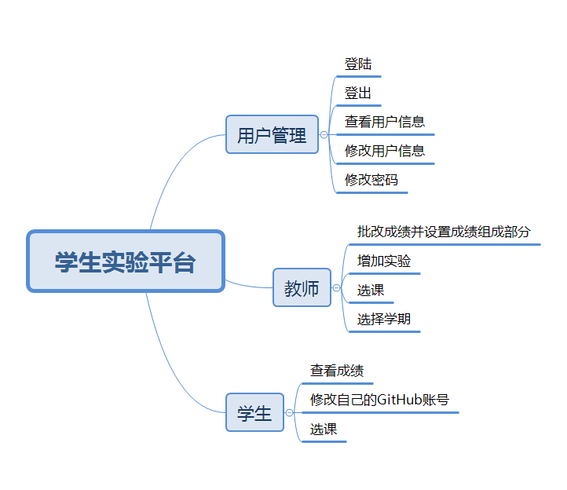
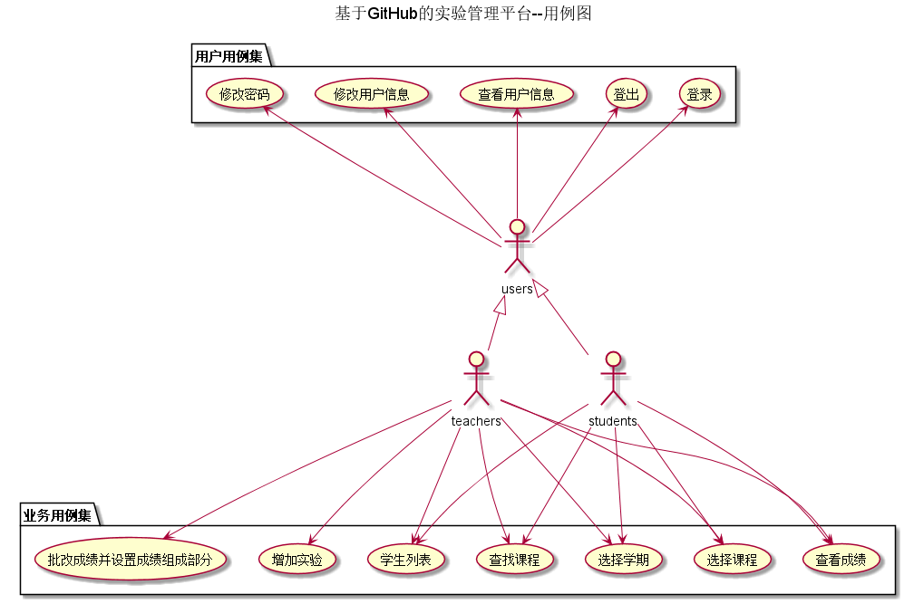
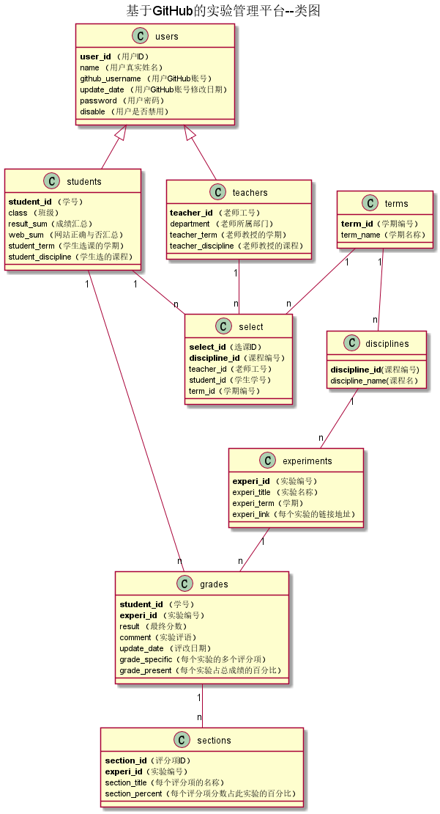

# 基于GitHub的实验管理平台的分析与设计

### 成都大学信息科学与工程学院
|学号|班级|姓名|照片|
|:-------:|:-------------: | :----------:|:---:|
|201510414401|软件(本)15-4|陈惠翔||

## 1. 概述
- 基于GitHub的实验管理平台的作用是在线管理实验成绩的Web应用系统。学生和老师的实验内容均存放在GitHUB
页面上。
- 学生的功能主要有：一是设置自己的GitHub用户名，二是查询自己的实验成绩。三是进行选课，但是必须在老师选完之后才能进行选课。学生的GitHub用户名是公开的，但成绩不公开。
- 老师的功能主要有：一是批改每个学生的成绩并且设置每个实验的具体评分项，二是查看每个学生的成绩，三是进行选课，选择对应学期的课程，四是增加不同课程的不同实验
- 老师和学生都能通过本系统的链接方便地跳转到学生的每个GitHUB实验目录，以便批改实验或者查看实验情况。
- 实验成绩按数字分数计算，每项实验的满分为100分且每项是有是有具体评分项组成，最低为0分。
- 系统自动计算每个学生的所有实验的平均分。
    
## 2. 系统总体结构

    
## 3. 用例图设计 [源码](src/finalTest_1.puml)

## 4. 类图设计 [源码](src/class.puml)

## 5. 数据库设计
- ### [参见数据库设计](./数据库设计.md)

## 6. 用例及界面详细设计
- ### [“查找课程”用例](./用例/查找课程.md),[界面](https://JasonChenhx.github.io/is_analysis/test6/ui/查看个人信息.html)
- ### [“选择课程”用例](./用例/选择课程.md),[界面](https://JasonChenhx.github.io/is_analysis/test6/ui/进行选课.html)
- ### [“选择学期”用例](./用例/选择学期.md),[界面](https://JasonChenhx.github.io/is_analysis/test6/ui/选择学期.html)
- ### [“增加实验”用例](./用例/增加实验.md),[界面](https://JasonChenhx.github.io/is_analysis/test6/ui/增加实验.html)
- ### [“学生列表”用例](./用例/学生列表.md),[界面](https://JasonChenhx.github.io/is_analysis/test6/ui/选择课程.html)
- ### [“批改成绩并设置成绩组成部分”用例](./用例/批改成绩并设置成绩组成部分.md),[界面](https://JasonChenhx.github.io/is_analysis/test6/ui/评定成绩.html)
- ### [“查看成绩”用例](./用例/查看成绩.md),[界面](https://JasonChenhx.github.io/is_analysis/test6/ui/学生查看具体评分项.html)
- ### [“修改密码”用例](./用例/修改密码.md),[界面](https://JasonChenhx.github.io/is_analysis/test6/ui/修改密码.html)
- ### [“修改用户信息”用例](./用例/修改用户信息.md),[界面](https://JasonChenhx.github.io/is_analysis/test6/ui/修改个人信息.html)
- ### [“查看用户信息”用例](./用例/查看用户信息.md),[界面](https://JasonChenhx.github.io/is_analysis/test6/ui/查看个人信息.html)
- ### [“登出”用例](./用例/登出.md),[界面](https://JasonChenhx.github.io/is_analysis/test6/ui/首页.html)
- ### [“登陆”用例](./用例/登陆.md),[界面](https://JasonChenhx.github.io/is_analysis/test6/ui/index.html)
