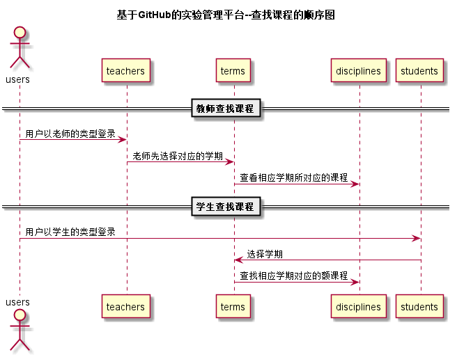

# “查找课程”用例 [返回](./README.md)
## 1. 用例规约

|用例名称|选择学期|
|-------|:-------------|
|功能|用户登录之后进入相应的学期，查看相应学期所对应的课程|
|参与者|学生，老师|
|前置条件|学生，老师需要先登录才能查看相应学期所对应的课程|
|后置条件| |
|主流事件| 1.用户以老师/学生的type登陆 2.选择学期 3.查看相应学期所对应的课程|
|备注| |

## 2. 业务流程（顺序图） [源码](../src/查找课程_sequence.puml)
 

## 3. 界面设计
- 界面参照: https://zwdbox.github.io/is_analysis/test6/ui/顶部菜单.html
- API接口调用
    - 接口1：[research_discipline](../接口/research_discipline.md)

## 4. 算法描述（活动图）

无

## 5. 参照表
- [USERS](../数据库设计.md/#USERS)
- [STUDENTS](../数据库设计.md/#STUDENTS)
- [TEACHERS](../数据库设计.md/#TEACHERS)
- [TERMS](../数据库设计.md/#TERMS)
- [DISCIPLINES](../数据库设计.md/#DISCIPLINES)
