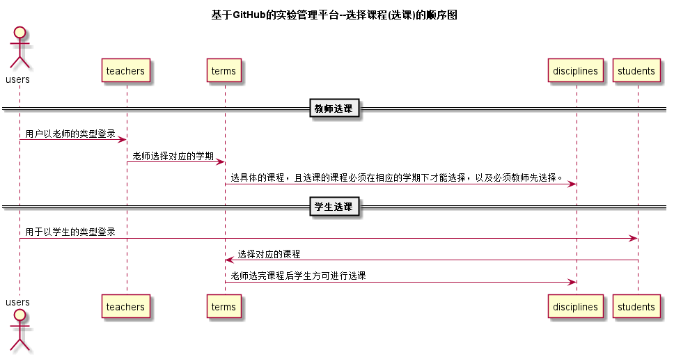

# “选择课程”用例 [返回](./README.md)
## 1. 用例规约

|用例名称|选择学期|
|-------|:-------------|
|功能|用户登录之后进入相应的学期，进行选课|
|参与者|学生，老师|
|前置条件|学生，老师需要先登录且已选择学期，以及老师必须先选择课程，老师选完之后学生选课的链接才能进入|
|后置条件| |
|主流事件| 1.用户以老师的type登陆 2.选择相应的课程 3.进行选课 4.教师选课结束后，学生登录系统 5.选择对应的学期 6.进行选课 7.提交按钮|
|备注| |

## 2. 业务流程（顺序图） [源码](../src/选择课程.puml)
 

## 3. 界面设计
- 界面参照: https://zwdbox.github.io/is_analysis/test6/ui/顶部菜单.html
- API接口调用
    - 接口1：[selectDiscipline](../接口/selectDiscipline.md)

## 4. 算法描述（活动图）

- 学生用户STUDENT_DISCIPLINE(老师用户TEACH_DISCIPLINE)解析为卡片块。
  - LEARN_DISCIPLINE为唯一返回值，返回值为数组，数组元素为课程名称，前台直接根据元素进行UI显示。

## 5. 参照表
- [USERS](../数据库设计.md/#USERS)
- [STUDENTS](../数据库设计.md/#STUDENTS)
- [TEACHERS](../数据库设计.md/#TEACHERS)
- [TERMS](../数据库设计.md/#TERMS)
- [DISCIPLINES](../数据库设计.md/#DISCIPLINES)
- [SELECTS](../数据库设计.md/#SELECTS)
