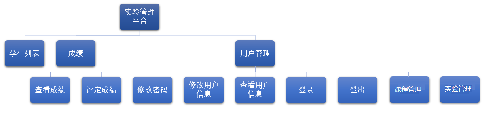
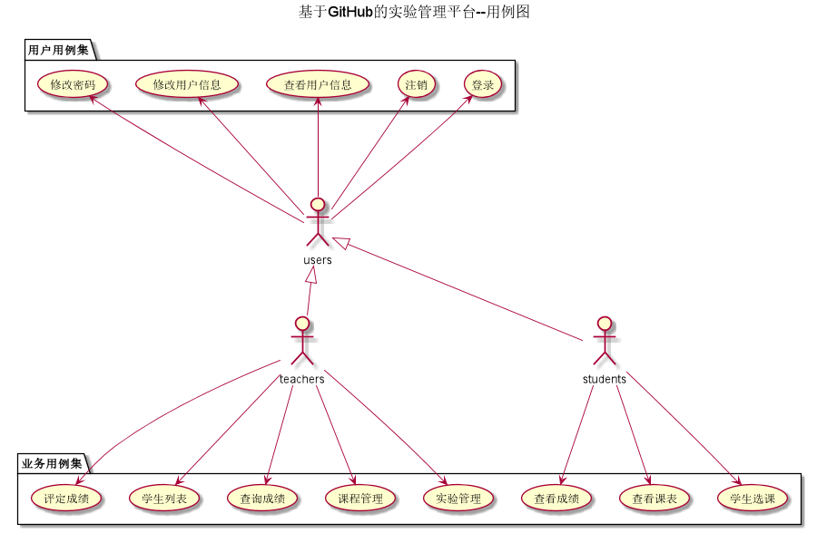

<!-- markdownlint-disable MD033-->
<!-- 禁止MD033类型的警告 https://www.npmjs.com/package/markdownlint -->

# 基于GitHub的实验管理平台的分析与设计

### 成都大学信息科学与工程学院

|学号|班级|姓名|照片|
|:-------:|:-------------: | :----------:|:---:|
|201511606101|软件(本)15-2|毕榆坚|无|

## 概述
- 基于GitHub的实验管理平台的作用是在线管理实验成绩的Web应用系统。学生和老师的实验内容均存放在GitHUB
页面上。
- 学生的功能主要有：一是设置自己的GitHub用户名，二是查询自己的实验成绩。学生的GitHub用户名是公开的，但成绩不公开。
- 老师的功能主要有：一是批改每个学生的成绩，二是查看每个学生的成绩。
- 老师和学生都能通过本系统的链接方便地跳转到学生的每个GitHUB实验目录，以便批改实验或者查看实验情况。
- 实验成绩按数字分数计算，每项实验的满分为100分，最低为0分。
- 系统自动计算每个学生的所有实验的平均分。

## 1.系统总体结构

## 2.界面设计

## 3.用例图设计 [源码](src/usercase.puml)

## 4.类图设计 [源码](src/class.puml)

## 5.数据库设计
- ### [参见数据库设计](数据库设计.md)

## 6.用例及界面详细设计
- ### [“学生列表”用例](user/“学生列表”用例.md)
- ### [“老师列表”用例](user/“老师列表”用例.md)
- ### [“学期列表”用例](user/“学期列表”用例.md)
- ### [“课程/实验/评分列表”用例](user/“课程列表”用例.md)
- ### [“查看成绩”用例](user/“查看成绩”用例.md)
- ### [“评定成绩”用例](user/“评定成绩”用例.md)
- ### [“查看学生信息”用例](user/“查看用户信息”用例.md)
- ### [“修改学生信息”用例](user/“修改用户信息”用例.md)
- ### [“查看老师信息”用例](user/“查看用户信息”用例.md)
- ### [“修改老师信息”用例](user/“修改用户信息”用例.md)
- ### [“修改密码”用例](user/“修改密码”用例.md)
- ### [“登录”用例](user/“老师列表”用例.md)
- ### [“登出”用例](user/“登出”用例.md)
