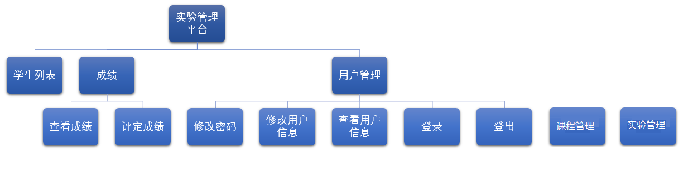
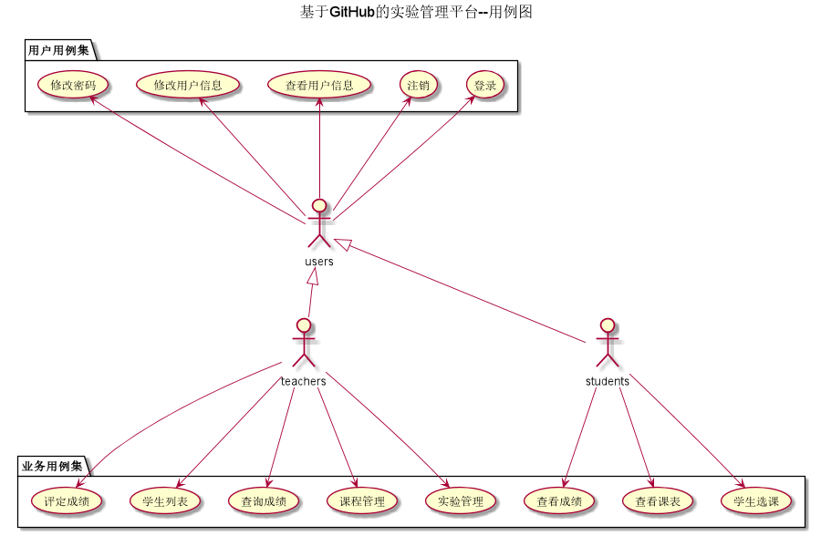
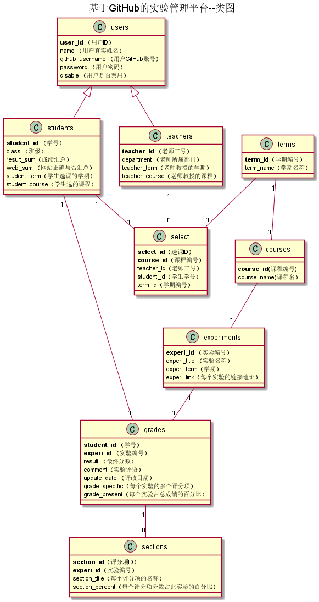

<!-- markdownlint-disable MD033-->
<!-- 禁止MD033类型的警告 https://www.npmjs.com/package/markdownlint -->

# 基于GitHub的实验管理平台的分析与设计

### 成都大学信息科学与工程学院

|学号|班级|姓名|照片|
|:-------:|:-------------: | :----------:|:---:|
|201511606101|软件(本)15-2|毕榆坚|无|

## 1.概述
- 基于GitHub的实验管理平台的作用是在线管理实验成绩的Web应用系统。学生和老师的实验内容均存放在GitHUB
页面上。
- 学生的功能主要有：一是设置自己的GitHub用户名，二是查询自己的实验成绩。学生的GitHub用户名是公开的，但成绩不公开。
- 老师的功能主要有：一是批改每个学生的成绩，二是查看每个学生的成绩。
- 老师和学生都能通过本系统的链接方便地跳转到学生的每个GitHUB实验目录，以便批改实验或者查看实验情况。
- 实验成绩按数字分数计算，每项实验的满分为100分，最低为0分。
- 系统自动计算每个学生的所有实验的平均分。

## 2.系统总体结构

## 3.用例图设计 [源码](src/usercase.puml)

## 4.类图设计 [源码](src/class.puml)

## 5.数据库设计
- ### [参见数据库设计](数据库设计.md)

## 6. 用例及界面详细设计
- ### [“登陆”用例](./用例/登陆.md),[界面](https://minutelight.github.io/is_analysis/test6/ui/home.html)
- ### [“注销”用例](./用例/登出.md),[界面](https://minutelight.github.io/is_analysis/test6/ui/home.html)
- ### [“学生查询个人信息”用例](./用例/查看用户信息.md),[界面](https://minutelight.github.io/is_analysis/test6/ui/学生个人信息查询.html)
- ### [“老师查询个人信息”用例](./用例/查看用户信息.md),[界面](https://minutelight.github.io/is_analysis/test6/ui/教师个人信息查询.html)
- ### [“学生选课”用例](./用例/学生和老师选课.md),[界面](https://minutelight.github.io/is_analysis/test6/ui/学生选课.html)
- ### [“老师选课”用例](./用例/学生和老师选课.md),[界面](https://minutelight.github.io/is_analysis/test6/ui/教师添加课程.html)
- ### [“增加实验”用例](./用例/增加实验.md),[界面](https://minutelight.github.io/is_analysis/test6/ui/教师添加实验.html)
- ### [“实验管理”用例](./用例/查看用户信息.md),[界面](https://minutelight.github.io/is_analysis/test6/ui/教师实验管理.html)
- ### [“学生列表”用例](./用例/学生列表.md),[界面](https://minutelight.github.io/is_analysis/test6/ui/查询学生成绩.html)
- ### [“批改成绩”用例](./用例/批改成绩.md),[界面](https://minutelight.github.io/is_analysis/test6/ui/评定成绩.html)
- ### [“查看成绩”用例](./用例/查看成绩.md),[界面](https://minutelight.github.io/is_analysis/test6/ui/学生个人主页.html)
- ### [“老师修改用户信息”用例](./用例/修改用户信息.md),[界面](https://minutelight.github.io/is_analysis/test6/ui/教师个人信息修改.html)
- ### [“老师查看个人信息”用例](./用例/查看用户信息.md),[界面](https://minutelight.github.io/is_analysis/test6/ui/教师个人信息查看.html)
- ### [“学生修改个人信息”用例](./用例/查看用户信息.md),[界面](https://minutelight.github.io/is_analysis/test6/ui/学生个人信息修改.html)
- ### [“学生查看个人信息”用例](./用例/查看用户信息.md),[界面](https://minutelight.github.io/is_analysis/test6/ui/学生个人信息查询.html)
