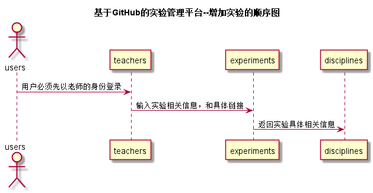

# “增加实验”用例 [返回](../README.md)

## 1. 用例规约

|用例名称|登录|
|-------|:-------------|
|功能|老师增加实验|
|参与者|教师|
|前置条件| 必须是以老师的类型登录才能增加实验 |
|后置条件|添加实验后，自动对本页面刷新，下方表格出现具体对应实验的名称和链接|
|主事件流| 1. 用户以老师的类型登录 2.首页上点击添加实验 3.输入实验内容和链接|
|备选事件流|1a. 输入的链接为空  &nbsp;&nbsp; 1.提示重新输入  |

## 2. 业务流程（顺序图） [源码](../src/addExperiments.puml)

 

## 3. 界面设计
- 界面参照: https://zwdbox.github.io/is_analysis/test6/ui/增加实验.html
- API接口调用
    - 接口1：[add_Experiments](../接口/add_Experiments.md)

## 4. 算法描述 
    
## 5. 参照表

- [USERS](../数据库设计.md/#USERS)
- [TEACHERS](../数据库设计.md/#TEACHERS)
- [EXPERIMENTS](../数据库设计.md/#EXPERIMENTS)
- [DISCIPLINES](../数据库设计.md/#DISCIPLINES)
